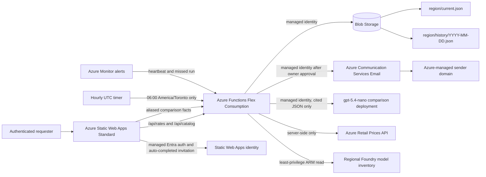

# Foundry Cost Lab

Foundry Cost Lab is a provenance-aware Azure AI cost modeller for customer-facing architecture sessions. It separates monthly estimates into Run, Guardrail, Platform, and Change tiers, keeps missing rates visibly unpriced, and records the rate-card date used for every export.

The output is a planning estimate, not a commercial quote.

All figures use native CAD retail prices returned by Azure's Retail Prices API. The application does not convert USD values or apply an exchange-rate assumption.

## Agent cost coverage

- Foundry hosted-agent runtime is modeled from vCPU-hours and GiB-hours across active sessions. Billed minutes include processing and the configured idle window; these usage lines do not scale with environment count.
- Agent tools are independent cost blocks: Code Interpreter sessions, File Search GB-days, Foundry skills execution hours, and Web Search grounding requests.
- Foundry Standard Agent Setup includes customer-managed Cosmos DB thread storage, Azure AI Search vector stores, and Hot ZRS Blob Storage for files, chunks, and embeddings.
- Cosmos DB supports provisioned throughput, with the documented 3,000 RU/s project minimum, or serverless request-unit modeling. Dedicated Search Units, semantic ranker, agentic retrieval reasoning, planner-model tokens, image extraction, Custom Entity Lookup, and embedding-model tokens are separate dimensions.
- Observability covers Analytics Logs ingestion, billable retention, archive, export, and 15-minute log alerts. Networking covers Private Link data processing, NAT Gateway, Azure Firewall Basic, and internet egress.
- Disaster recovery is service-specific across PTUs, API Management, Search Units, Cosmos throughput, Blob capacity, private endpoints, application compute, and inter-region traffic. Enabling it replaces the legacy blanket secondary-region multiplier.
- These are planning allocations only. The calculator's `infra/` deployment does not provision a customer's Foundry, Cosmos DB, AI Search, or agent file-storage resources.

## Foundry catalog coverage

- Every Toronto morning, the Function queries the supported `Microsoft.CognitiveServices/locations/models` ARM endpoint for Canada Central, Canada East, East US, and East US 2, normalizes unique model versions, and promotes dated regional snapshots only when the result is non-empty.
- The UI merges that live regional inventory with a dated 150-entry full-provider snapshot. Regional entries are labelled `regional`; entries absent from ARM remain visibly snapshot-backed instead of being presented as freshly verified.
- Models are searchable under **Direct from Azure**, **Foundry Labs**, **Hugging Face**, and **Fireworks on Foundry**. Catalog presence does not assert regional quota, subscription eligibility, or Marketplace acceptance.
- Token API models use input/output token volume. Hugging Face managed-compute models use instance-hours. Image, audio, embedding, scientific, and other modalities use an explicit native usage quantity.
- Model and deployment SKU form one pricing key. Global Standard, Data Zone Standard, Regional Standard, Global/Data Zone Batch, Global/Data Zone/Regional Provisioned, Developer, Marketplace, and managed-compute selections never inherit another SKU's fallback.
- The current exact GPT-4o mappings cover Global Standard input/cached-input/output, Global Batch input/output, and Global Provisioned PTU plus PAYG overflow. Unsupported model/SKU combinations remain unpriced.
- Approved Marketplace, private-offer, or managed-compute rates can be saved as a source- and date-stamped scenario profile for exactly one model/SKU. Verified native CAD rate-card values always take precedence over that profile.
- The results view shows the selected processing boundary, every required rate dimension, Retail versus fallback coverage, and approval blockers. A catalog entry is never represented as a priced deployment.
- The Run configuration also includes 18 dated service definitions across Content Understanding, Speech, Translation, and Language. Their definition date is visible in the UI; each service has an independent usage quantity and rate.
- The catalog is discovery and cost-planning metadata; this application does not create the customer model deployments being estimated. Their availability must be confirmed against the target subscription, region, quota, and provider terms. The small comparison model described below is a separate internal utility.

## Scenario comparison

- Select exactly two or three saved scenarios in **Scenarios**, then open the dedicated comparison workspace. A fourth selection is blocked in both current and migrated browser state.
- Every scenario is recalculated against the current rate card and catalog for its own saved region. The comparison never reuses a different scenario's totals or treats an unpriced line as zero.
- The deterministic scorecard shows known monthly and annual subtotal, delta from the selected baseline, cost per monthly user, cost per 1,000 agent turns, pricing completeness, security controls, private networking, disaster recovery, tier distribution, top line-item drivers, and changed assumptions.
- **Executive**, **Finance**, **Security**, and **Architecture** buyer lenses expose the evidence needed for a defensible customer decision. Optional **AWS**, **Google**, and **Databricks** lenses frame discovery gaps without fabricating competitor prices or declaring a winner.
- “Lowest known subtotal” is used instead of “winner” whenever pricing coverage differs. Missing implementation effort, migration, commitments, data gravity, operational labour, and business outcome evidence remain explicit discovery items.

### Optional grounded brief

The comparison remains fully usable without AI. When enabled, **Explain trade-offs** asks a dedicated `gpt-5.4-nano` deployment to turn deterministic facts into a concise sales brief; it does not calculate totals or choose the recommended scenario.

- The browser sends aliases `A`, `B`, and `C`, buyer/competitor lenses, and at most 24 bounded facts. Scenario names and complete saved configurations never leave the browser.
- The API treats fact text as untrusted data, requires schema-constrained JSON, rejects unknown citations, and requires citations for the summary, Microsoft win themes, and competitive exposure.
- The model is keyless: local account authentication is disabled and the Function user-assigned identity has `Cognitive Services OpenAI User` only on the comparison model account.
- Per-user usage is SHA-256 keyed and limited to 20 generations per UTC day in private Blob Storage. Briefs are cached best-effort in the user's browser by aliased facts and selected lenses.
- The East US 2 deployment uses GA `gpt-5.4-nano` `2026-03-17`, Global Standard, at 10K TPM. With native CAD Retail rates of `$0.2818/million` input tokens and `$1.7613/million` output tokens, a planning envelope of 3K input plus the enforced 1,000-completion-token cap is about CAD `$0.00261` per brief, `$0.0521` at one user's daily limit, or `$1.56` if that user exhausts the limit every day for 30 days. Reasoning effort is disabled for this extraction-style task.

## Architecture



The browser never calls an external pricing or ARM endpoint. Failed synchronization preserves each last-good `current.json`; zero-meter and zero-model results cannot promote a snapshot. `/api/health` reports all four regions and returns `503` when any rate or catalog snapshot is missing or more than 36 hours old.

## Installable mobile app

Foundry Cost Lab is an installable Progressive Web App (PWA). It uses the existing Static Web Apps deployment and adds no Azure resource or material Azure consumption.

- On supported Chromium browsers, use the download icon in the header or the browser's **Install app** action.
- On iPhone and iPad, open the site in Safari and use **Share → Add to Home Screen**. Apple does not expose a programmable install prompt.
- The installed app uses the Microsoft four-pane icon, opens in standalone mode, and retains the same managed Entra `costlab-user` requirement.
- A refresh icon appears when a new service-worker version is ready; applying it reloads the current release.
- Only versioned JavaScript, CSS, theme, icon, and manifest assets are precached. HTML navigation, `/api/*`, and `/.auth/*` remain network-only and are never stored by the service worker, so installation does not bypass authentication.
- PDF generation libraries are loaded only when Export PDF is selected and are excluded from PWA installation precache.
- A network connection is required to launch and authenticate. This is intentionally not an offline copy of protected scenarios or pricing data.

## Repository

| Path | Purpose |
|---|---|
| `web/` | React 18, TypeScript, Vite, Zustand, Radix, and Recharts client |
| `api/` | Node.js 22 Azure Functions v4 API and scheduled rate sync |
| `infra/` | Pinned Azure Verified Module composition for `azd` |
| `.azure/deployment-plan.md` | Deployment workflow source of truth |

## Local development

Prerequisites: Node.js 22+, npm, and optionally Azure Functions Core Tools plus Azurite for the API host.

```powershell
Set-Location web
npm ci
npm run dev -- --host 127.0.0.1
```

The client runs at `http://127.0.0.1:5173/`. By default, Vite serves the dated built-in CAD rate card and model catalog through local `/api` bridges, so local development does not produce API 404s.

### Live local rates and catalog

The production timer refreshes at 06:00 Toronto time. For an immediate local refresh, sign in with Azure CLI and run the same production synchronizers on demand:

```powershell
$env:AZURE_SUBSCRIPTION_ID = az account show --query id --output tsv
npm --prefix api run sync:local
```

This writes current and dated history snapshots under `api/data/`.

The existing Vite development server detects those files on the next API request; reload `http://127.0.0.1:5173/` and the header changes to **Synced rates**. No Vite restart or Functions host is required for this normal local workflow.

To test the complete Azure Functions host as well, start Azurite and Functions in separate terminals:

```powershell
Set-Location api
npx --yes azurite --silent --location .azurite
```

```powershell
Set-Location api
$env:AzureWebJobsStorage = 'UseDevelopmentStorage=true'
$env:FUNCTIONS_WORKER_RUNTIME = 'node'
$env:AZURE_FUNCTIONS_ENVIRONMENT = 'Development'
npx --yes --package azure-functions-core-tools@4 func start --port 7071
```

Then restart Vite after setting the proxy target; the variable is read only at startup:

```powershell
$env:LOCAL_FUNCTIONS_URL = 'http://127.0.0.1:7071'
npm --prefix web run dev -- --host 127.0.0.1
```

Confirm the full Function-host path with `Invoke-RestMethod http://127.0.0.1:7071/api/health`. Re-run `npm --prefix api run sync:local -- --region=eastus` whenever an immediate active-region refresh is needed. Omit `--region` to refresh all four supported regions; add `--rates-only` or `--catalog-only` to limit the operation. Deployed Azure runs both automatically each Toronto morning.

For the API:

```powershell
Set-Location api
npm ci
Copy-Item local.settings.example.json local.settings.json
npm start
```

When `RATE_STORAGE_ACCOUNT_URL` is empty, the API uses `api/data/` for local rate and catalog history. Set `AZURE_SUBSCRIPTION_ID` to test live regional catalog synchronization. Azure uses managed identity and Blob Storage.

## Verification

```powershell
Set-Location web
npm test
npm run lint
npm run build
npm run test:e2e
npm run test:pwa

Set-Location ..\api
npm test
npm run build
npm audit
```

Current evidence: 68 web unit/property tests, 49 API tests, 15 application workflows, and 3 production PWA device profiles pass. Browser coverage includes automatic invitation completion, requester/approver access flows, desktop, Android, iPhone-sized metadata/layout, PDF/JSON downloads, mobile installation, secure offline cache boundaries, four-region isolation, model/SKU profile isolation, all five technical pricing domains, three-scenario comparison, aliased AI facts, no-overflow checks, and zero Axe violations. Both builds and linters pass.

## Rate policy

- Synced GPT-4o token/SKU meters, hosted-agent runtime, Code Interpreter, File Search, skills execution, Search premium features, Sentinel, API Management, AI Search, Cosmos DB, Blob Storage, observability, Private Link, NAT Gateway, Azure Firewall Basic, and supported inter-region transfer are normalized from named Azure Retail Prices API meters.
- Manual model rates are scoped to one model/SKU, visually distinct, and carry their offer source and as-of date.
- Unmatched or ambiguous services remain `null` and appear as **Unpriced**. Known subtotals never imply completeness.
- Regional internet egress uses each region's exact Microsoft Global Network CAD tiers, including the first 100 GB at `$0`; it is not flattened into one rate.
- Private Link endpoint-hours use the exact global CAD meter. Private Link data processing is a separate usage dimension.
- Azure AI Search S1 uses each region's exact CAD unit meter. Canada East publishes `Standard S1 Unit` at CAD `$0.4734/hour`.
- Canada East has no availability zones, so Standard Agent Setup file storage is priced and labelled as Hot LRS there. Canada Central, East US, and East US 2 use their exact regional Hot ZRS meters. The UI surfaces the lower Canada East resilience rather than treating LRS as equivalent to ZRS.
- Internal tenant members do not consume External ID MAU. Guest/external MAU is disabled by default; the first 50,000 Basic MAU is explicitly `$0`, and above-threshold CAD remains manual until an exact tenant offer is supplied.
- Integrated Foundry model filtering is the default and does not create a standalone Content Safety line. The optional standalone API uses the selected region's exact Standard text-record meter; Canada Central uses Canada East because no Canada Central Standard meter is published. One record is up to 1,000 Unicode code points.
- Analytics Logs ingestion uses the paid Retail tier beginning at 5 GB. The scenario input remains billable volume after the free allowance, so the zero-price allowance is never applied to the entire workload.
- PTU capacity is model-specific and has no default. Spillover remains unpriced until capacity is supplied.
- Web Search offers, embedding models, partner Marketplace/private offers, and an unspecified DR application-compute SKU remain manual. Inter-region transfer falls back to manual when the exact source/destination/direction meter is not represented.
- Usage meters do not multiply by environment count. Fixed platform infrastructure uses `production + (N - 1) × non-production ratio`; explicit service-specific DR is additive and disables the legacy secondary-region multiplier.

Grounding run on `2026-08-23` using the production synchronizers:

| Pricing region | Exact Retail meter specs matched | Unmatched definitions | Region-confirmed Foundry models |
|---|---:|---:|---:|
| Canada Central | 59 | 20 | 167 |
| Canada East | 53 | 26 | 156 |
| East US | 59 | 20 | 168 |
| East US 2 | 58 | 21 | 203 |

Unmatched definitions remain explicitly unpriced. These counts validate the configured calculator meters and regional ARM inventory; they do not claim that every Azure retail meter or Marketplace offer is modeled.

## Access management

Production uses the managed Microsoft Entra provider and native Static Web Apps invitations. It does not require a custom app registration, client secret, Microsoft Graph permission, tenant admin consent, or role-source Function.

### Request and approval workflow

1. A user signs in with Microsoft Entra ID. If they do not have `costlab-user`, the 403 response displays **Request access** instead of a dead-end denial page.
2. The requester confirms their authenticated email and optionally supplies a business reason. One private record per Static Web Apps user is written under `access-requests/` in the existing Blob container.
3. Users with `costlab-admin` see an access-request shield in the application header. A badge shows pending requests.
4. **Approve** creates and privately persists a 24-hour `costlab-user` invitation; **Reject** records the decision without granting access.
5. The requester page polls every five seconds and follows the approved invitation automatically with the already signed-in Microsoft account. A **Complete access** link remains only as a fallback if the browser interrupts SSO.
6. After approval is durable, the Function sends a welcome email containing the same completion link, expiry, application link, and feedback request. Repeated approval does not create or email twice.

Security boundaries:

- The SWA edge permits the self-service endpoint only to `authenticated`; queue and decision endpoints require `costlab-admin`.
- Azure Functions independently decode `x-ms-client-principal` and repeat authenticated/admin role checks.
- The Function managed identity receives Static Web App read plus `Microsoft.Web/staticSites/*/action` at the one target app. Every currently published non-invitation action is explicitly excluded; the wildcard bridges Azure's published `createinvitation` versus enforced `createUserInvitation` action-name mismatch.
- The same identity receives `Communication and Email Service Owner` only at the one Communication Services resource. Email uses Entra tokens; no ACS access key or connection string is stored.
- Invitation bearer URLs are stored only in private Blob storage and returned only to the matching requester. The admin queue never returns them.
- Request logs contain only a one-way request ID and timestamps, not email addresses, business reasons, or invitation URLs. The owner queue receives only sanitized delivery status and error codes.
- The invitation and approval record are persisted before email is attempted. Delivery failure is recorded as `failed` and never blocks requester-page completion.

Approval email uses one free `AzureManagedDomain` linked to one global Communication Services resource, with data location `United States`, fixed `DoNotReply` sender identity, disabled engagement tracking, and `ritwickdutta@microsoft.com` as the default reply-to address. Azure-managed sender domains cannot be personalized.

The grounded East US 2 native-CAD Retail meters are CAD `$0.0004` per sent email and CAD `$0.0002/MB` transferred, effective `2023-04-01`. At 100 small approvals, send charges are approximately CAD `$0.04` plus negligible transfer. The Azure-managed domain is intentionally for low volume: 5 emails/minute and 10 emails/hour, with no quota increase available. The request-page fallback protects access when that limit or any transient delivery failure is encountered.

The current operator has both `costlab-user` and `costlab-admin`. To grant another owner approval rights after they have received application access:

```powershell
az staticwebapp users update `
  --name swa-foundry-cost-rm6kp7ehyjzk `
  --resource-group rg-foundry-cost-prod `
  --authentication-provider AAD `
  --user-details <owner-email> `
  --roles costlab-user,costlab-admin
```

The CLI invitation remains an operational fallback if the request service is unavailable:

```powershell
az staticwebapp users invite `
  --name swa-foundry-cost-rm6kp7ehyjzk `
  --resource-group rg-foundry-cost-prod `
  --authentication-provider AAD `
  --user-details <colleague-email> `
  --roles costlab-user `
  --domain salmon-plant-01ce70c0f.7.azurestaticapps.net `
  --invitation-expiration-in-hours 24
```

Send the returned link only to the named recipient. Microsoft Conditional Access still applies while the page completes access.

The header **Export PDF** action creates a shareable, multipage CAD estimate containing scenario inputs, tier totals, detailed monthly costs, unpriced decisions, rate provenance, formulas, assumptions, disclaimers, and page numbers. PDF is a read-only report and cannot be re-imported.

The Scenarios dialog provides **Backup JSON** and **Import JSON** for editable handoff between colleagues. Import accepts only the CAD schema, discards exported totals, sanitizes values, and recalculates against the recipient's current rate card. Saved scenarios remain browser-local.

## Azure preparation

Set the required `azd` environment values before validation or deployment:

```powershell
azd env new prod
azd env set AZURE_SUBSCRIPTION_ID <subscription-guid>
azd env set AZURE_LOCATION eastus2
azd env set OPERATIONS_ALERT_EMAIL <operations-email> # optional
azd env set ACCESS_EMAIL_REPLY_TO ritwickdutta@microsoft.com # optional override
```

The approved deployment uses East US 2 for Static Web Apps Standard, Flex Consumption, LRS Blob Storage, the 0.5 GB/day Log Analytics workspace, and the optional Global Standard comparison model. This hosting choice does not change the calculator's independent Canada Central, Canada East, East US, and East US 2 pricing scopes. Static Web Apps, Functions, and the Entra-authenticated model endpoint remain publicly reachable; Storage public network access and shared-key authentication are disabled, and the Function reaches Blob through a private endpoint with its user-assigned managed identity. The model account also disables local-key authentication.

Provisioning requires permission to create a custom role definition and assignment at subscription scope, plus the application resources. Use an approved combination such as Contributor and Role Based Access Control Administrator. The custom role grants only `Microsoft.CognitiveServices/locations/models/read`.

## Production readiness

The validated production deployment is available at [Foundry Cost Lab](https://salmon-plant-01ce70c0f.7.azurestaticapps.net/). The linked API health endpoint reports every configured rate card and catalog. Anonymous calculator and data routes redirect to managed Entra sign-in; `/api/health` is intentionally anonymous.

The current operator accepted a `costlab-user` invitation, holds `costlab-admin`, and verified the calculator in managed Microsoft Edge. The source is maintained at [ritwickmicrosoft/foundry-cost-lab](https://github.com/ritwickmicrosoft/foundry-cost-lab). The deploy workflow still requires its documented GitHub environment and OIDC configuration before it can publish autonomously.

### Production operations

The hourly timer performs the full refresh during the 06:00 Toronto hour. A fresh environment also bootstraps automatically while any required snapshot is absent. If snapshots are missing after a deployment or recovery, invoke that bootstrap through the secured host-admin endpoint and keep its key in process memory:

```powershell
$functionName = azd env get-value SERVICE_API_NAME
$hostKey = (az functionapp keys list --name $functionName --resource-group rg-foundry-cost-prod --query masterKey --output tsv).Trim()
try {
  Invoke-WebRequest -UseBasicParsing -Method Post `
    -Uri "https://$functionName.azurewebsites.net/admin/functions/syncRates" `
    -Headers @{ 'x-functions-key' = $hostKey } `
    -ContentType 'application/json' -Body '{}'
} finally {
  $hostKey = $null
}
```

An off-hour invocation skips when all eight current snapshots already exist: one rate card and one catalog for each region. For a controlled post-deployment rate-definition refresh, temporarily set `FORCE_RATE_SYNC=true`, invoke the secured timer once, and remove the setting immediately; the default remains closed. Otherwise, complete snapshots refresh during the next Toronto morning window. Require `https://salmon-plant-01ce70c0f.7.azurestaticapps.net/api/health` to return `200 healthy` after deployment or recovery. The severity-1 failure alert evaluates every 15 minutes; the severity-2 missed-success alert evaluates hourly. Both target the `Foundry Cost Lab operations` action-group email receiver.

GitHub is optional for a one-off local `azd` deployment. To use the supplied CI/deployment workflows, initialize a repository, push it to an approved GitHub organization, configure the `production` environment, and add the OIDC, subscription, location, and operations-email settings referenced by `.github/workflows/deploy.yml`.

### Colleague feedback pass

Share the Static Web Apps URL only after access and health checks pass. Ask the colleague to verify:

- An approved user's Entra sign-in succeeds and an unapproved user is denied.
- Canada Central, Canada East, East US, and East US 2 show synchronized rates and the expected regional model-availability labels.
- Lean POC and Production presets communicate incomplete assumptions clearly.
- Model-source filters, Foundry services, Hosted Agents, and Standard Agent Setup inputs match their architecture workflow.
- Rate provenance and unavailable reasons are understandable without verbal explanation.
- Saving, exporting, importing, and comparing up to three scenarios works across two browsers; the generated brief uses aliases and cited deterministic facts only.
- Desktop and mobile layouts are usable, and no confidential customer identifiers are entered in scenario names.

Model quota, Marketplace acceptance, and provider terms remain validation requirements for each customer architecture being estimated. They are independent of the calculator's small, dedicated `gpt-5.4-nano` deployment used only for optional comparison narratives.

The Production preset intentionally remains incomplete for six decisions that cannot be inferred defensibly: model-specific PTU capacity, Defender for AI transaction scope/rate, Purview workload/capacity, security revalidation labour, FinOps labour, and the support plan. Their exact unavailable reasons appear in provenance.

No customer subscription credentials or customer-identifying shared scenario data are stored. Scenarios and scenario names remain in each user's browser; only bounded, aliased comparison facts can reach the optional model.